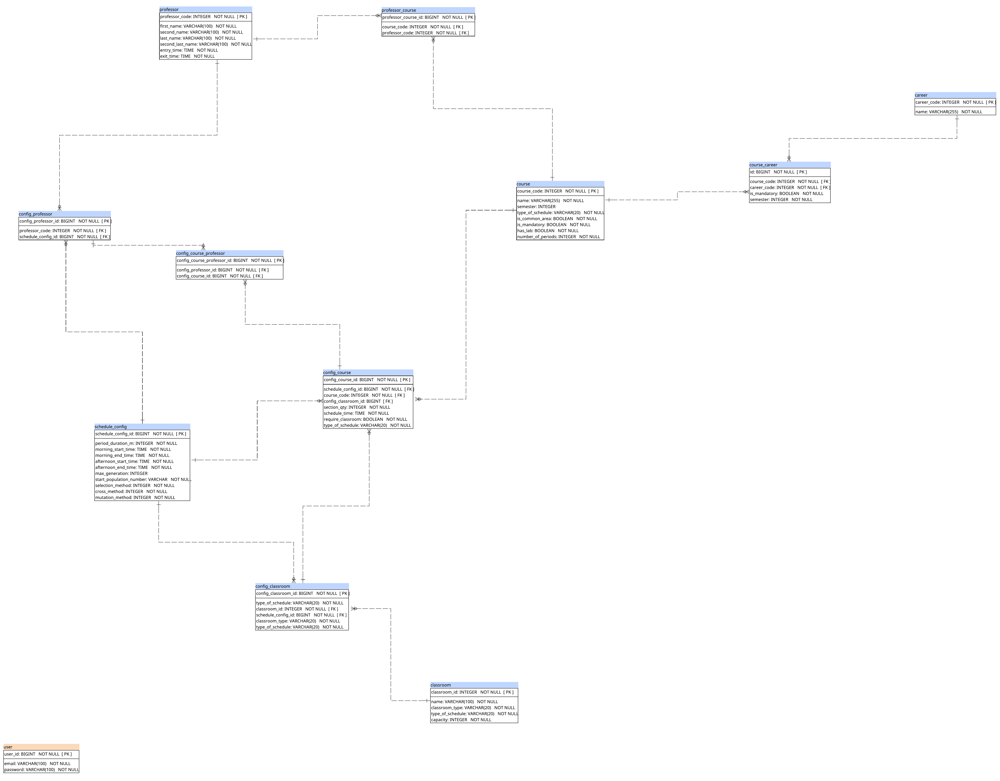

# Actores

- **Administrador**: Este proyecto no contempla varios roles o usuarios. Se podría decir que el único usuario es el “operador” del sistema. Encargado de manejar y configurar todo.

# Historias de usuario

## Administrador

### 1. Gestión de cursos

**Como** admin, **quiero** gestionar los cursos **para** tener: Ver listado, crear nuevo curso, editar curso y eliminar curso.

**Nota:** Preguntar por sección en la carga de datos

**Criterios de aceptación:**

- El curso debe tener al menos los siguientes campos: Nombre, código, carreras con semestre y tipo (obligatorio u optativo), tipo_horario (mañana, tarde, ambos), tiene_lab (boolean).
- No deben haber cursos con el mismo código
- Un curso puede estar en múltiples carreras y semestres. Ej. Administración de Empresas para Ing. Industrial en el 8vo semestre y Administración de Empresas para Ing. Sistemas en 6to Semestre. Por lo menos debe haber una carrera y semestre asignado a ese curso a menos que el curso se marque como `Área común`.
- Si el curso es de `Área común`, debe tener un semestre asignado.
- Si el curso es de `Área común`, debe indicar si es obligatorio
- Si el curso ha sido usado para crear un horario no puede eliminarse
- El curso debe tener el número de periodos que ocupa (por defecto 1). Por ejemplo para algunos cursos como Matemática básica 1, son 2 periodos.

### 2. Gestión de salones

**Como** admin, **quiero** gestionar los salones **para** tener: Ver listado, crear nuevo salón, editar salón y eliminar salón.

**Criterios de aceptación:**

- El salón debe tener al menos los siguientes campos: Nombre del salón, id, tipo (lab, curso o ambos), cantidad de estudiantes, tipo_horario (mañana, tarde o ambos).
- No deben haber salones con el mismo nombre

### 3. Gestión de docentes

**Como** admin, **quiero** gestionar a los docentes **para** tener: Ver listado, crear nuevo docente, editar docente y eliminar docente.

**Criterios de aceptación:**

- El docente debe tener al menos los siguientes campos: Nombre, registro de personal, hora de entrada y salida.
- Un docente puede ser asignado “por defecto” a uno o más cursos (pueden ser 0). Esto hará que, en la configuración de un horario, aparezca por defecto como uno de los docentes “preferidos”, sin embargo esto se puede alterar.

### 4. Carga de datos

**Como** admin, **quiero** tener la opción de cargar datos de cursos, salones, docentes y relaciones de docentes **para** tener datos en el sistema.

**Criterios de aceptación:**

- La carga debe ser por medio de archivos csv
- El formato de dichos archivos es el siguiente:

  Cursos: Nombre, código, carrera, semestre, sección, tipo (obligatorio u optativo).
  Salones: Nombre del salón, id.
  Docentes: Nombre, registro de personal, hora de entrada y salida.
  Relación Docente-Curso: curso_código, docente_registro

### 5. Configuración de generación de horarios:

**Como** admin, **quiero** poder crear “configuraciones” de generación de horarios **para** crear y analizar múltiples escenarios.

**Criterios de aceptación:**

- El “tiempo” por periodo debe ser 50 minutos por defecto, sin embargo este valor puede ser configurado entre un rango de 10 minutos (40 minutos a 60 minutos)
- Se puede modificar los rangos de las jornadas
- Por defecto se cargarán todos los salones disponibles, pudiendo configurar cuáles son de laboratorio, curso o ambos (se deberán cargar el tipo por defecto establecido en cada curso). Mostrar la cantidad de estudiantes, si existe.
- Un salón por defecto tiene un tipo de horario (mañana, tarde o ambos). Esto puede ser modificado en la configuración.
- Al agregar un curso, se deben cargar sus docentes por defecto, aunque estos se pueden modificar.
- Un curso se puede asignar un salón por defecto (de los salones seleccionados).
- A un curso puede se puede asignar la cantidad de secciones (por defecto 1 y máximo 2).
- Un curso puede ser fijado a un horario
- Un curso puede ser marcado como: Sin salón
- Un curso por defecto tiene un tipo de horario (mañana, tarde, ambos). Esto puede ser modificado en la configuración
- Se podrá definir un número máximo de generaciones (si no se aplica un valor óptimo).
- Se podrá configurar la cantidad de población inicial (por defecto: _Definir)_
- Se podrá definir el criterio de finalización
- Se podrá definir métodos de selección, cruce y mutación

### 6. Modificación Manual de Horarios Generados

**Como** admin, **quiero** poder modificar los horarios generados **para** ajustarlos a mis necesidades.

**Criterios de aceptación:**

- El sistema debe mostrarme advertencias de los posibles choques, sin embargo debe permitirme hacer los cambios

### 7. Generación de Reportes y Estadísticas

**Como** admin, **quiero** poder ver reportes y estadísticas **para** obtener detalles de los horarios y de las ejecuciones de los algoritmos

- Las columnas representan los salones.
- Las filas representan los horarios.
- Generación de horario con cursos y laboratorios
- Generación de horario solo de cursos.
- Generación de horario solo de laboratorios.
- Generación de horario con filtrado por año, semestre o carrera.

---

# Manual técnico

## Diseño de base de datos

La siguiente imagen muestra el modelo relacional base del proyecto:

## Explicación de tablas y relaciones

### Entidades maestras

- **`career`**
  - Catálogo de carreras.
  - PK: `career_code`.
  - Se relaciona con `course_career` (1 carrera -> muchas asignaciones curso-carrera).

- **`course`**
  - Catálogo de cursos.
  - PK: `course_code`.
  - Campos relevantes: nombre, tipo de horario, obligatorio, área común, laboratorio, número de periodos.
  - Relaciones:
    - con `course_career` (1 curso -> muchas carreras/semestres).
    - con `config_course` (1 curso -> muchas configuraciones por escenario).
    - con `professor_course` (asignación global docente-curso, opcional según flujo).

- **`professor`**
  - Catálogo de docentes.
  - PK: `professor_code`.
  - Incluye horarios de disponibilidad (`entry_time`, `exit_time`).
  - Relaciones:
    - con `config_professor` (docentes seleccionados por escenario).
    - con `professor_course` (preferencias globales docente-curso).

- **`classroom`**
  - Catálogo de salones.
  - PK: `classroom_id`.
  - Campos relevantes: nombre, tipo (curso/lab/ambos), tipo de horario, capacidad.
  - Relación con `config_classroom` para selección por escenario.

### Entidades puente de negocio

- **`course_career`**
  - Relación N:N entre curso y carrera, con contexto académico.
  - Claves foráneas: `course_code`, `career_code`.
  - Define `semester` e `is_mandatory` para reglas de colisión académica.
  - Es clave para validar choques entre cursos obligatorios del mismo semestre/carrera.

- **`professor_course`**
  - Relación global docente-curso (preferencias base).
  - Puede usarse como apoyo para preselección, aunque en la corrida GA manda la configuración específica.

### Entidades de configuración de escenario

- **`schedule_config`**
  - Cabecera del escenario de generación.
  - Define duración de periodo, rangos mañana/tarde y parámetros GA (población, métodos, generaciones).
  - Relación 1:N con:
    - `config_professor`
    - `config_classroom`
    - `config_course`

- **`config_professor`**
  - Docentes habilitados para un `schedule_config`.
  - Relación N:1 con `professor` y N:1 con `schedule_config`.

- **`config_classroom`**
  - Salones habilitados para un `schedule_config`.
  - Relación N:1 con `classroom` y N:1 con `schedule_config`.
  - Incluye reglas por escenario: `classroom_type` y `type_of_schedule`.

- **`config_course`**
  - Cursos habilitados para un `schedule_config`.
  - Relación N:1 con `course` y N:1 con `schedule_config`.
  - Campos relevantes para GA:
    - `section_qty`
    - `require_classroom`
    - `type_of_schedule`
    - `is_fixed`, `fixed_day_index`, `fixed_start_slot`
    - `config_classroom_id` opcional como salón por defecto.

- **`config_course_professor`**
  - Relación N:N entre `config_course` y `config_professor`.
  - Define los docentes válidos por curso en un escenario.
  - Regla funcional:
    - si hay un docente, se considera fijo;
    - si hay varios, cualquiera es elegible;
    - si no hay, se usa pool de `config_professor`.

### Entidades de horarios generados (modelo actual)

- **`generated_schedule`**
  - Guarda cada ejecución de GA como un horario generado nuevo.
  - Incluye métricas: fitness, penalties, cobertura, estado.
  - Guarda snapshot de slots (`periodDurationM`, ventanas mañana/tarde) para estabilidad histórica.

- **`generated_schedule_item`**
  - Detalle editable del horario (equivale a genes persistidos).
  - Campos principales: curso, sección, sesión, día, slot inicial, periodos, salón, docente, estado de asignación.
  - Se usa para mostrar y editar horario en frontend.

## Resumen de relaciones clave

- `course` <-> `career` por `course_career`.
- `schedule_config` -> (`config_course`, `config_professor`, `config_classroom`).
- `config_course` <-> `config_professor` por `config_course_professor`.
- `generated_schedule` -> `generated_schedule_item`.
- `generated_schedule_item` referencia la configuración (`config_course`, `config_professor`, `config_classroom`) para trazabilidad.

---

## Algoritmo genético (consideraciones técnicas)

## 1. Preparación de entrada

- Construir universo de datos desde `schedule_config` y sus tablas `config_*`.
- Calcular slots por truncamiento:
  - `morningSlots = floor((morningEnd - morningStart) / periodDuration)`
  - `afternoonSlots = floor((afternoonEnd - afternoonStart) / periodDuration)`
- Expandir cursos por sección (`section_qty`) y sesiones (`CLASS` / `LAB`).
- Preparar candidatos de docente/salón por gen según reglas de configuración.

## 2. Codificación del gen

- Un gen representa una asignación de bloque para curso-sección-sesión.
- Atributos mínimos: curso, sección, `dayIndex`, `startSlot`, `periodCount`, salón, docente.
- `dayIndex`:
  - `0 = CLASS` (bucket Lunes/Miércoles/Viernes)
  - `1 = LAB1` (Martes)
  - `2 = LAB2` (Jueves)

## 3. Población inicial

- Generar cromosomas iniciales a partir de los genes base.
- Respetar restricciones fuertes desde el inicio (o penalizar fuerte si no se puede).
- Permitir estados no asignados (`UNASSIGNED_*`) cuando no hay recursos suficientes.

## 4. Selección

- Métodos soportados por configuración:
  - Ruleta (roulette)
  - Torneo
- La selección debe favorecer mejor fitness pero mantener diversidad.

## 5. Cruce

- Métodos soportados:
  - One-point crossover
  - Uniform crossover
- Debe proteger genes fijos (`is_fixed`) y no romper bloques obligatorios.

## 6. Mutación

- Métodos soportados:
  - Reasignación (día/slot/recurso)
  - Intercambio (swap)
- En mutación, conservar invariantes de factibilidad:
  - bloques contiguos,
  - límites de slots,
  - compatibilidad básica de recursos.

## 7. Fitness

- Compuesto por penalties ponderados:
  - **Hard penalties**: choques inválidos y violaciones estructurales.
  - **Feasibility penalties**: no asignado de docente/salón.
  - **Soft penalties**: preferencias (p. ej., clase en día de laboratorio).

- Reglas importantes del dominio:
  - LAB y clase-en-día-lab deben ocupar 3 periodos contiguos.
  - Choques de salón/docente por `dayIndex + slot`.
  - Colisión académica entre obligatorios por carrera/semestre.
  - Curso de área común obligatorio colisiona con obligatorios de todas las carreras en el mismo semestre.

## 8. Criterio de parada

- Basado en `maxGeneration` y/o convergencia por mejora marginal.

## 9. Persistencia y edición manual

- Al generar, se guarda un nuevo `generated_schedule` + `generated_schedule_item`.
- El frontend trabaja con `slots + items`.
- Edición manual permitida con advertencias:
  - se recalcula fitness en cada cambio,
  - se devuelven `warnings`,
  - el cambio se permite aunque existan conflictos.

## 10. Consideraciones operativas

- Mantener snapshot de slots en `generated_schedule` evita inconsistencias si cambia `schedule_config`.
- Tratar IDs como string en API evita problemas de serialización cuando se usa BigInt.
- Registrar métricas de corrida facilita análisis y comparación de escenarios.
